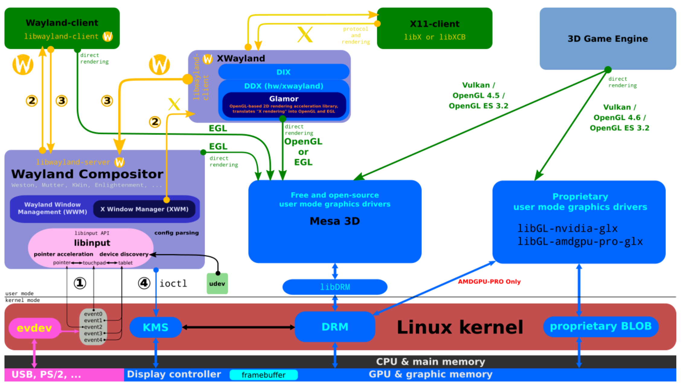

# Linux Graphics Stack Overview

## Overview

This section, being the first one and bearing the name, will introduce the overall architecture of Linux graphics software. Each component may be introduced in its own chapter. Here is a quick glance to the big pictures, otherwise it's easy to get lost in understanding the relationship of these components since the graphics is complex and too many components are involved in hardware, kernel space, user space server and applications.

This is an overview diagram of the Linux graphics stack from bootlin slides:

This diagram covers the fairly recent Linux graphics environment as it was written in 2020 ([youtube](https://www.youtube.com/watch?v=wjAJmqwg47k), [slides](https://bootlin.com/pub/conferences/2020/lee/kocialkowski-overview-linux-userspace-graphics-stack/kocialkowski-overview-linux-userspace-graphics-stack.pdf)). The `Wayland` is used as the user space server instead of X11, though many Linux distributions didn't switch to `Wayland` at the time this diagram was made (for example Ubuntu switched to `Wayland` by default in 22.04 release).

## Others' Overview for Linux Graphics Stack

[bootlin](https://bootlin.com) has a training for the same topic and covers a lot of details. The slides is free to download from their website, any interested reader must find it quite helpful: [https://bootlin.com/training/graphics/](https://bootlin.com/training/graphics/).

A recent LWN two articles series about the Linux Graphics Stack: [The Linux graphics stack in a nutshell, part 1](https://lwn.net/Articles/955376/), [The Linux graphics stack in a nutshell, part 2](https://lwn.net/Articles/955708/).

This is an overview in 2012, although Wayland is not mentioned, and some chapters are incomplete, but overall it's informative: [Linux Graphics Drivers: an Introduction](https://people.freedesktop.org/~marcheu/linuxgraphicsdrivers.pdf).
