# Intel GPU Architecture

Please see the following official public documents for detailed information about Intel Xe architecture.

- [Intel Graphics for Linux - Programmer's Reference Manuals](https://www.intel.com/content/www/us/en/docs/graphics-for-linux/developer-reference/1-0/overview.html)
- [oneAPI GPU Optimization Guide / Intel Xe GPU Architecture](https://www.intel.com/content/www/us/en/docs/oneapi/optimization-guide-gpu/2024-2/intel-xe-gpu-architecture.html)
- [Intel® Processor Graphics Xᵉ-LP API Developer and Optimization Guide](https://www.intel.com/content/www/us/en/developer/articles/guide/lp-api-developer-optimization-guide.html)
- [Intel Processor Graphics](https://www.intel.com/content/www/us/en/developer/articles/guide/intel-graphics-developers-guides.html) (not updated since initial Xe/Gen12 generation but contains links to previous Gen documents)

The summary below is a quick cheat-sheet for the basic concepts and most important features. The details cannot be summarized all here and it's not necessary to do so, instead, the summary here serves the purpose that the user can get the basic understanding of the Intel Xe architecture and find the links to some official or other well-written documents.

## Intel Xe GPU Structure Overview

In Programmer's Reference Manuals above, this overview block diagram is used for many years.

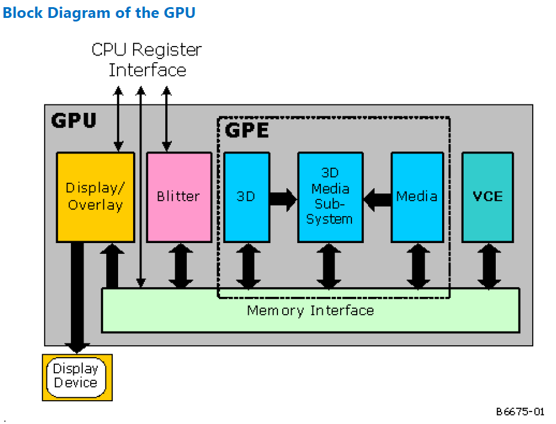

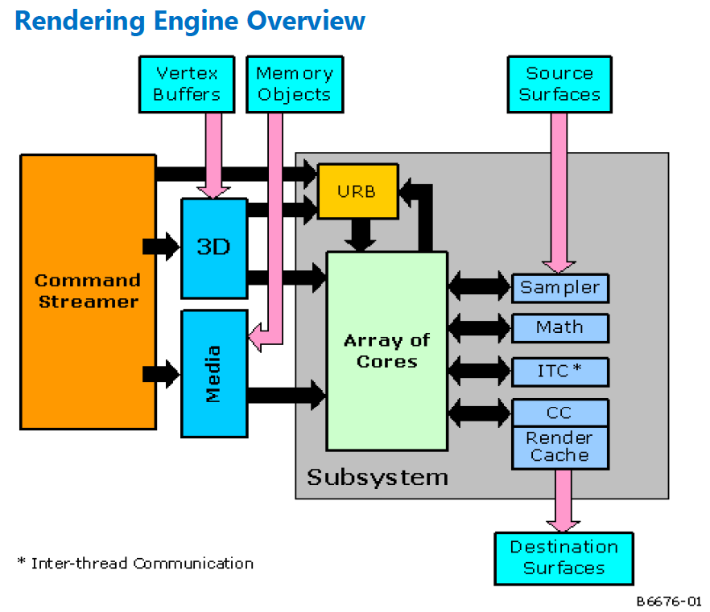

Some terminologies should be explained first:

- **Blitter**: block image transferrer.
- **GPE**: Graphics Processing Engine.
- **VCE**: Video Codec Engine. Or more referred as **MFX** (Multi-Format Codec engine) recently.
- **CS**: Command Stream (CS) Unit, manages the pipelines and forwards command streams to the active pipeline.
- **EU**: Execution Unit. Programmable computing unit, see later sections for the details.
- **Shared functions**: hardware unites which serve to provide specialized supplemental functionality for the EUs. In the *Rendering Engine Overview* diagram, the *Array of Cores* are the EUs, the light blue diagrams at the right are share functions.
- **Fixed functions**: units that the functionality is fixed. In the diagram, the VCE is a fixed function unit for video encoding and decoding, the 3D and media pipelines are also pipelines of some fixed function units.

The above diagrams are simplified and relatively out of date for architectures of latest generations. Below are some diagrams for the recent architectures.

The Xe-HPC *Ponte Vecchio* diagram:

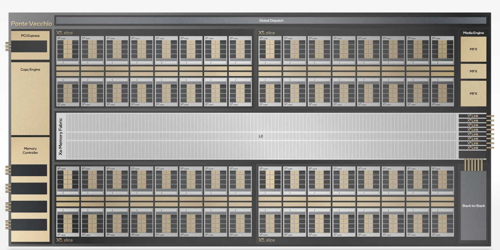

The Xe-HPG *Alchemist* diagram (from *Intel Graphics for Linux - Programmer's Reference Manuals* 2023 version Volume 4):

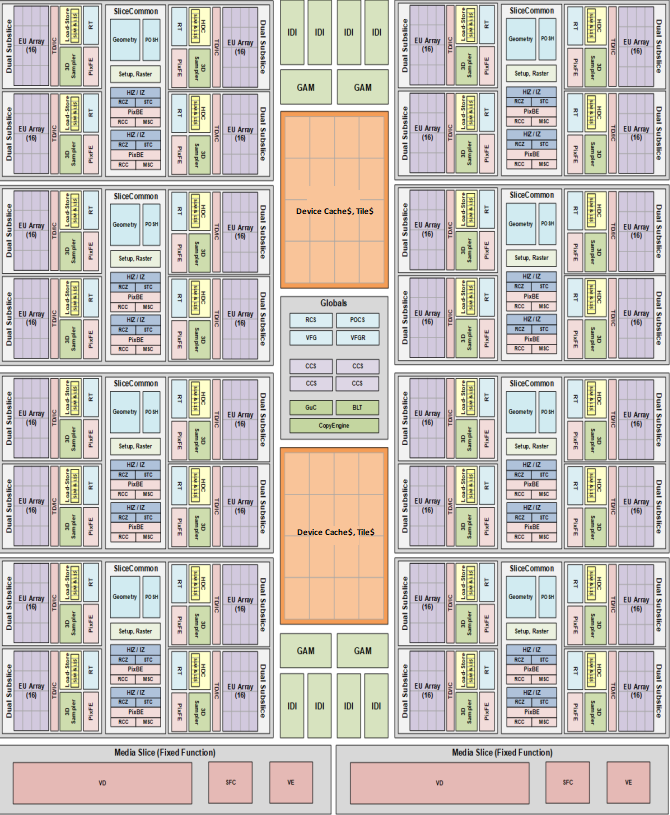

The Xe2-LPG *Lunar Lake* integrated GPU diagram:

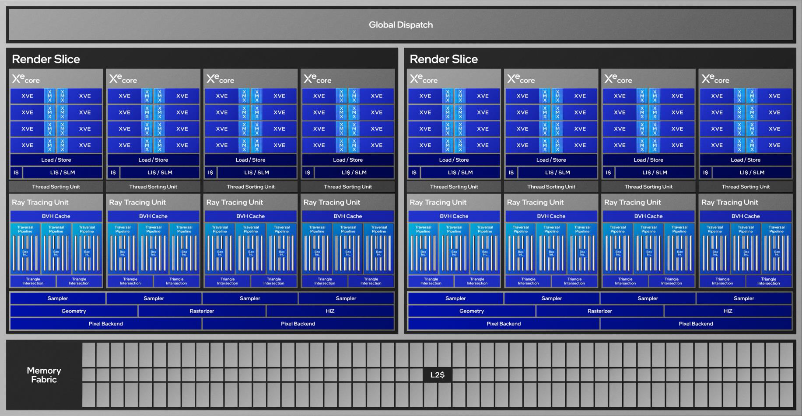

## Architecture Terminology Changes

| Old Gen Term                         | New Intel Xe Term          | Generic Term  | New Abbreviation |
| ------------------------------------ | -------------------------- | ------------- | ---------------- |
| Execution Unit (EU)                  | Xe Vector Engine           | Vector Engine | XVE              |
| Systolic/"DPAS part of EU"           | Xe Matrix eXtension        | Matrix Engine | XMX              |
| Subslice (SS) or Dual Subslice (DSS) | Xe-Core                    | NA            | XC               |
| Slice                                | Render Slice/Compute Slice | Slice         | SLC              |
| Tile                                 | Stack                      | Stack         | STK              |

## Xe Architecture Render/Compute Slice

The Xe architecture derives from the previous Intel Gen graphics architecture, the initial Xe architecture is Gen12 if the Gen naming continues. So the Xe and Gen have a lot in common, for example the smallest unit EU.

### Xe-LP

The Xe-LP architecture's building blocks consist of these units, from the smallest units and each level up consisting the smaller units into a group:

- **Xe-LP Execution Unit (EU)**: 8-wide SIMD ALU for FP32/FP16/INT32/INT16/INT8 and 2-wide SIMD ALU for SIMD2 extended math operations.
- **Xe-LP Dual Subslice**: consists of 16 EUs, an instruction cache, a local thread dispatcher, Shared Local Memory (SLM) and a data port of 128B/cycle. It is called dual subslice because the hardware can pair 2 EUs for SIMD16 executions.
- **Xe-LP Slice**: consists of six (dual) subslices for a total of 96 EUs, up to 16MB L2 cache, 128B/cycle bandwidth to L2 and 128B/cycle bandwidth to memory.

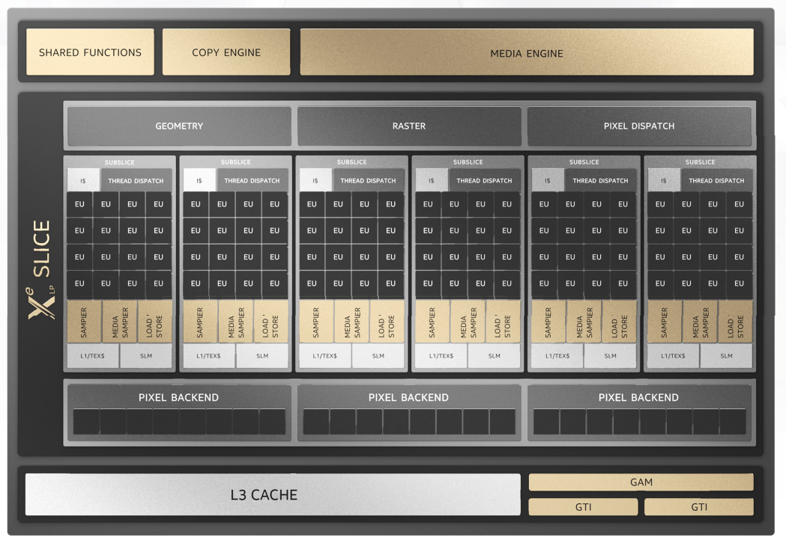

### Xe-HPG

Xe-HPG and Xe-HPC use the new Xe-Core as the smallest unit comparing to the EU in Xe-LP and previous Gen.

- **Xe-Core**: consists of vector and matrix ALUs, which are referred to as vector and matrix engines. Each vector engine is 256 bit wide, supporting 8 FP32 SIMD operations with fused FMAs. Each matrix engine is 1024 bit wide. Xe-Core provides 512B/cycle load/store bandwidth to the memory system.
- **Xe-Slice**: consists of Xe-Cores, ray-tracing units and hardware context.
- **Xe-Stack**: consists of Xe-Slices, HBM2e controllers, media engine, Xe-Links, shared L2 caches.

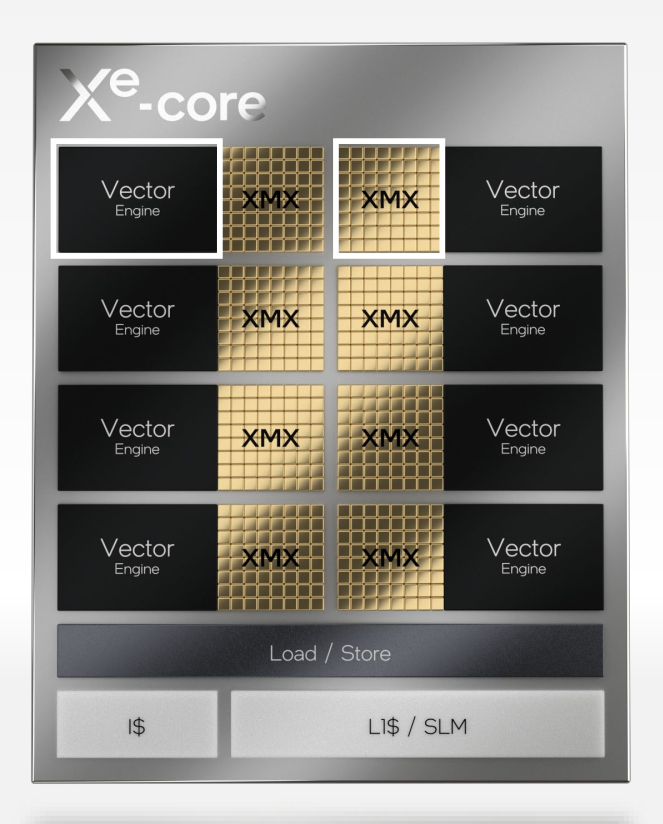

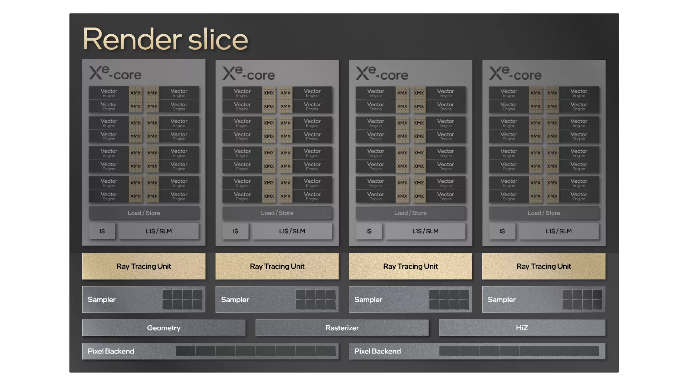

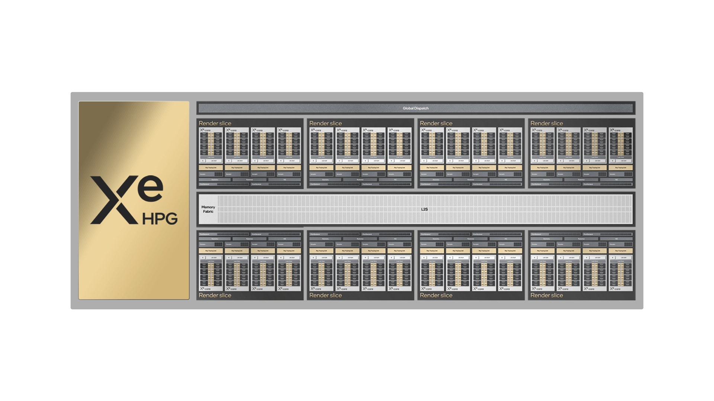

Please note the numbers of Xe-Cores in Xe-Slice, Xe-Slices in Xe-Stack are not fixed. It may vary depending on the Xe-HPG, Xe-HPC or SKU.

### Xe2-LPG

Xe2-LPG architecture has many improvements in different aspects of the GPU, in the Xe Vector Engine the ALU upgrades from SIMD8 to SIMD16, XMX is added for iGPU like Xe-HPG, FP64 unit is added with Extended Math unit. See [Xe2-LPG (Lunar Lake)](#Xe2-LPG-(Lunar-Lake)) for other updates.

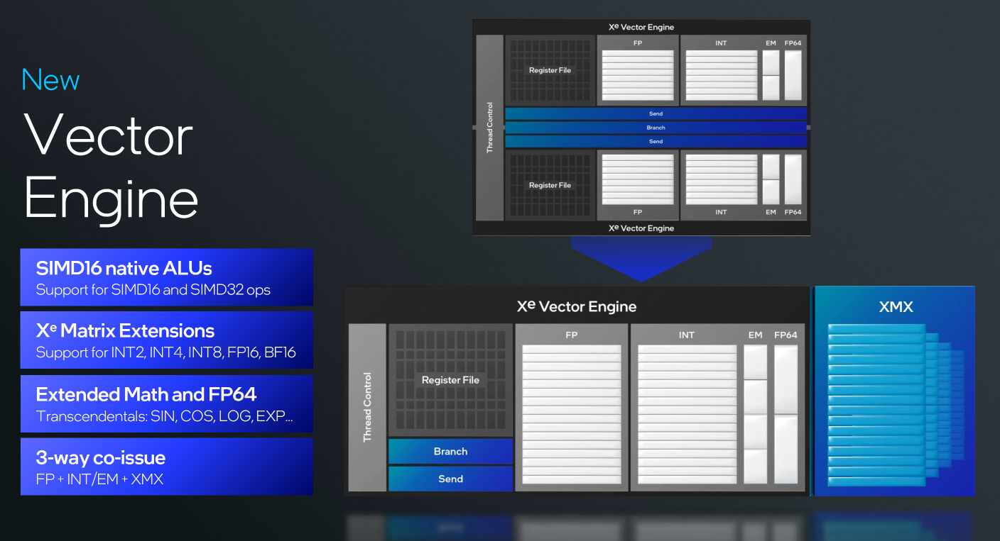

## Xe Architecture Cache/Memory attributes

The Xe architecture cache memory attributes are summarized here.

- Each Xe-Core has an Instruction Cache.
- Each Xe-Core has a L1 Cache and SLM (Shared Local Memory) for all Xe Vector Engines in the Xe-Core.
- SLM (Shared Local Memory): Shared memory for all Xe Vector Engines in one Xe-Core to use. One important usage of SLM is to share atomic data and signals among the concurrent work-items executing in a Xe-Core.
- There are LL Cache (Last Level Cache): Device Cache (dGPU) or L2 Cache (iGPU) for the whole GPU connecting to the memory controller.
- URB (Unified Return Buffer): The on-chip memory managed/shared by Fixed Functions in order for a thread to return data that will be consumed either by a Fixed Function or other threads.

In pre-Xe Gen generations, it used to be L1/L2 Cache in the internal units and L3 Cache shared by the iGPU, then it connects to the LLC then the system memory DRAM. See the below Gen9 Slice architecture, there are L1/L2 sampler Cache in subslice and a L3 Cache shared, and SLM in inside the L3 Cache.

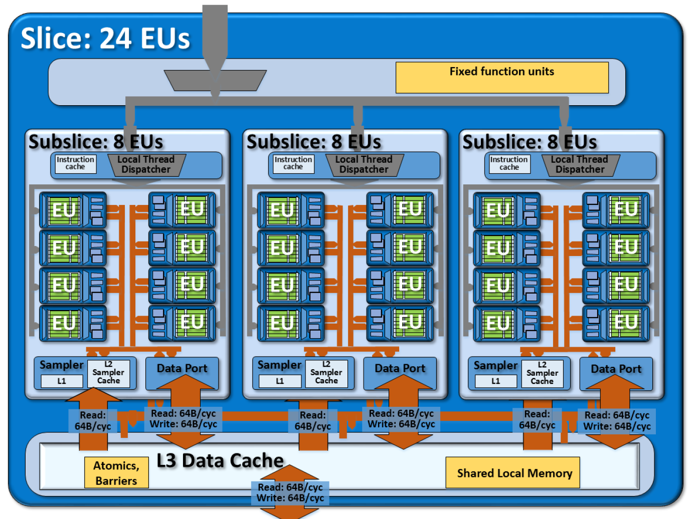

The below numbers are from Xe-HPG A770.

| Cache/memory                | Number               | Size | Total Size |
| --------------------------- | -------------------- | ---- | ---------- |
| URB (Unified Return Buffer) | 8 (per Render Slice) | 480K | 480K x 8   |
| Instruction Cache           | 32 (per Xe-Core)     | 96K  | 96K x 32   |
| L1 Cache                    | 32 (per Xe-Core)     | 192K | 192K x 32  |
| SLM (Shared Local Memory)   | 32 (per Xe-Core)     | 128K | 128K x 32  |
| Device Cache                | 1                    | 16MB | 16MB       |

## Generation Details

### Xe Generation Characteristics Comparison

| **Architecture**             | Xe-LP (Tiger Lake)  | Xe-HPG (Arc A770)   | Xe-LPG (Meteor Lake) | Xe2 (Lunar Lake)     |
| ---------------------------- | ------------------- | ------------------- | -------------------- | -------------------- |
| Render Slice count           | 1                   | 8                   | 2                    | 2                    |
| Xe-Core per Render Slice     | 6                   | 4                   | 4                    | 4                    |
| Xe-Core (DSS/SS) count       | 6                   | 32                  | 8                    | 8                    |
| Xe Vector Engine per Xe-Core | 16                  | 16                  | 16                   | 8                    |
| Xe Vector Engine count       | 96                  | 512                 | 128                  | 64                   |
| Thread per Xe Vector Engine  | 7                   | 8                   | 8                    | 8                    |
| Thread count                 | 672                 | 4096                | 1024                 | 512                  |
| Xe Vector Engine Width       | 256-bit 8 FP32 SIMD | 256-bit 8 FP32 SIMD | 256-bit 8 FP32 SIMD  | 512-bit 16 FP32 SIMD |
| Ray-tracing unit count       | NA                  | 32                  | 8                    | 8                    |
| FLOPs per clock - FP32, MAD  | 1536                | 8192                | 2048                 | 2048                 |

### Xe2-LPG (Lunar Lake)

[Xe2 and Lunar Lake GPU Deep Dive](https://cdrdv2-public.intel.com/824434/2024_Intel_Tech%20Tour%20TW_Xe2%20and%20Lunar%20Lakes%20GPU.pdf)

[Lunar Lake’s iGPU: Debut of Intel’s Xe2 Architecture](https://chipsandcheese.com/p/lunar-lakes-igpu-debut-of-intels)

### Xe-HPG (ARC A770)

[Intel Graphics for Linux - Programmer's Reference Manuals - Alchemist/Arctic Sound-M Platform](https://www.intel.com/content/www/us/en/docs/graphics-for-linux/developer-reference/1-0/alchemist-arctic-sound-m.html)

Refer to Volume 4 for detailed device attributes.

### Gen11 (Ice Lake) and Gen9 (Skylake)

Some details for the legacy Gen11 and Gen9 generations. Also, the "Intel Graphics for Linux - Programmer's Reference Manuals" has previous versions for legacy Gen architectures.

[Intel® Processor Graphics Gen11 Architecture](https://www.intel.com/content/dam/develop/external/us/en/documents/the-architecture-of-intel-processor-graphics-gen11-r1new.pdf)

[The Compute Architecture of Intel® Processor Graphics Gen9](https://www.intel.com/content/dam/develop/external/us/en/documents/the-compute-architecture-of-intel-processor-graphics-gen9-v1d0-166010.pdf)

