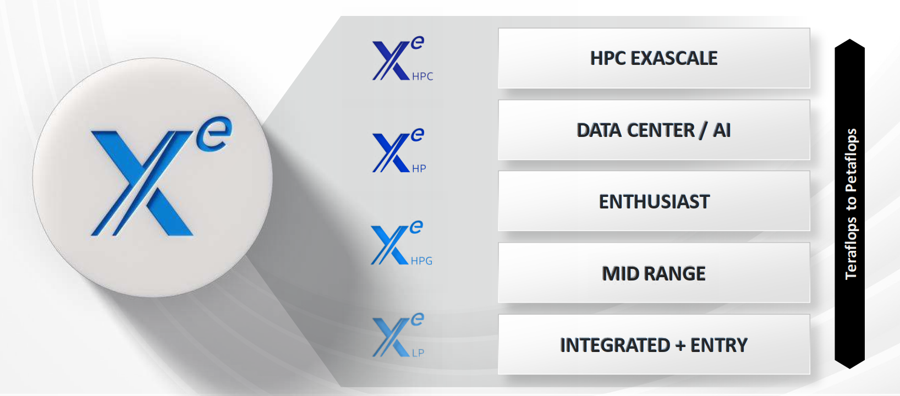

# Xe, Discrete GPU and Future

## Intel Xe

Intel decided to re-enter the discrete GPU market in 2018 with the new Xe brand. The effort started with recruiting Raja Koduri, the AMD Radeon Technologies Group leader, to join Intel to lead the GPU development. The goal was to provide a series of GPU micro-architectures to a wide range of GPU markets from the low power integrated GPU in the CPU, discrete desktop gaming GPU, to the data center high performance computing for HPC and AI accelerating. The four segments of the Xe micro-architectures are Xe-LP (low power), Xe-HPG (high performance gaming), Xe-HP (high performance, for data center) and Xe-HPC (high performance computing, for data center). The Xe-LP integrated GPUs followed the original Intel integrated GPU naming, using Iris, UHD etc. The discrete desktop GPU for gaming was given a brand name "Arc" later near release. Th

The Xe GPU development didn't go well as planned, despite the integrated Xe-LP in the Intel Core CPUs at that time, the desktop discrete GPU was delayed for more than one year. The initial Iris Xe MAX discrete card (internally named "DG1") was released in 2021 with only Intel's own and a few OEM cards in small numbers, the performance was merely slightly better or almost the same as the integrated GPU of the Tiger Lake CPU. In 2022, the retail launch of the first generation "Alchemist" Intel discrete GPU under Arc brand (internally named "DG2") came after more than one year's delay. Together with the this release, the first four generation code names were announced: Alchemist, Battlemage, Celestial, Druid. The server segment GPU "Ponte Vecchio" was also in delay at the same time.

At 2024 the second generation of desktop discrete GPU "Battlemage" is rumored to be release in the end of year or early 2025. The Xe-HPC line "Ponte Vecchio" was a failure and announced to be in sunsetting process in May 2024, just about one year later of its 2023 release, and the successor Falcon Shores is in internal development. The only line that continues releasing is the integrated GPU Xe-LP line, or as the later name Xe-LPG, in Meteor Lake and Lunar Lake CPUs.

## Xe Family

### Xe, 1st generation

The Intel® Xe GPU family consists of a series of microarchitectures, ranging from integrated/low power (Xe-LP), to enthusiast/high performance gaming (Xe-HPG), data center/AI (Xe-HP) and high performance computing (Xe-HPC).

- **Xe-LP (Low Power)**: Integrated GPU, removed FP64 support.
- **Xe-LPG (Low Power Graphics)**: Integrated GPU on Meteor Lake and Lunar Lake, Xe-LP plus some features from Xe-HPG like ray-tracing. Introduced when Meteor Lake was available: [Xe-LPG on MTL](https://www.anandtech.com/show/20046/intel-unveils-meteor-lake-architecture-intel-4-heralds-the-disaggregated-future-of-mobile-cpus/7).
- **Xe-HPG (High Performance Graphics)**: The microarchitecture is focused on graphics performance and supports hardware-accelerated ray tracing. The first four generations are code named Alchemist, Battlemage, Celestial, Druid.
- **Xe-HP (High Performance)**: Data center and high performance variant of Xe architecture with FP64 and multi-tile scalability. But [soon it was cancelled](https://www.tomshardware.com/news/intel-axes-xe-hp-gpus-for-datacenters).
- **Xe-HPC (High Performance Compute)**: HPC/AI domain variant of Xe architecture, Ponte Vecchio is powered by Xe-HPC.

### Xe2

At Q3 of 2024 Intel Lunar Lake processor is shipping with the integrated GPU of Xe2 architecture. It's the second generation of Xe architecture and maybe a preview of the Battlemage discrete GPU.

## Future

The Intel Xe architecture currently has 3 variants: integrated GPU Xe-LPG, discrete GPU Xe-HPG, and data center redesigned Falcon Shores with both Intel Gaudi and Intel Xe IP integrated. The road map for integrated GPU Xe-LPG is much clearer than the others since no matter what integrated GPU in Intel Core Ultra is still needed. The discrete GPU line has a long gap between Alchemist and Battlemage, and the future is unclear. The Falcon Shores architecture is under development and its architecture and details are not available to public.
